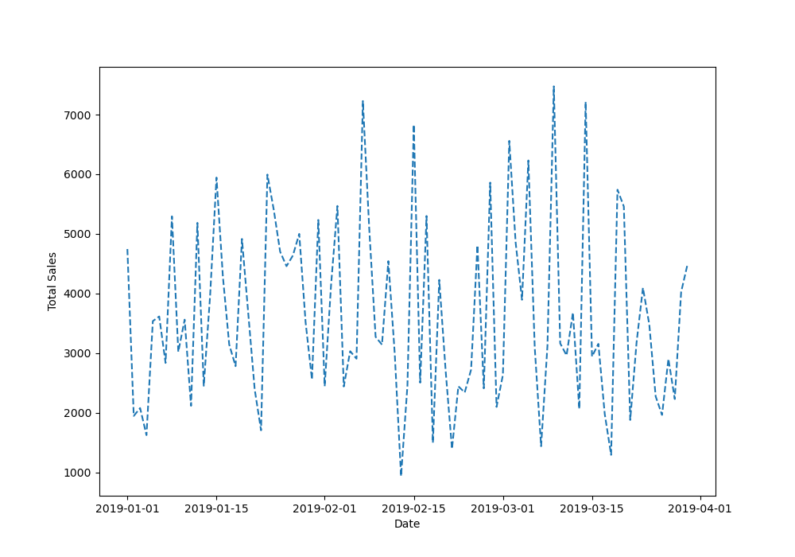

# SUPERMARKET SALES ANALYSIS REPORT
_Prepared by Thatayotlhe Dinona_  
  _Date: 23/11/2024_

### PROJECT OVERVIEW 
This analysis intends to investigate the market sales of an imaginary supermarket to gain insights and identify areas of improvement and optimize operations to drive growth and profitability. 
### OBJECTIVES
1. To determine the times of the day when sales are highest?
2. To analyse customer ratings to gauge satisfaction levels?
3. To determine the payment methods used by customer?
4. To determine which product line are most profitable?
5. To analyse sales by customer demographic (gender and member)
6. To compare sales performance across branches
7. To determine the total sales revenue over a specific period?
### DATA ANALYSIS METHODOLOGY
This is a systematic process of inspecting ,cleaning, transforming data with the goal of discovering useful information and this was done using python with libraries such as **pandas, matplotlib , seaborn and numpy** imported.
 * ##### DATA COLLECTION 
The dataset used was from [Kaggle](https://www.kaggle.com/datasets/aungpyaeap/supermarket-sales) the dataset shape is 1000 rows and 13 columns. Data quality assessment was conducted to ensure the data is accurate, free from null values and consisent and also relevant to the analysis objectives.
* ##### DATA CLEANING
The following common data quality issues were checked with the help of pandas library which is well suited for data manipulation and data cleaning.  
* Missing data
* Inconsistent data formatting
* Outliers
* Duplicates
* Incorrect data type
* Renaming columns
   
 The dataset was further refined by correcting erros of data type mismatches , renamed columns and further removed columns which were not applicable to my analysis. 

* #### DATA EXPLORATION
  Data exploration techinques were employed which involves descriptive statistics to provide summary statistics(mean, mode, median, quartiles,standard deviation,etc) to have a rough understanding of the data before diving deep into earthing insights. Histograms, boxplot/whisker, kernel density were of use to help with identifying outliers,patterns and trends in the dataset.

  
* #### DATA VISUALISATION
  Visuals were created to support analysis and visualise patterns, trends and insights of the data.

 1.  *Total sales revenue over a specific period?*
    
  
